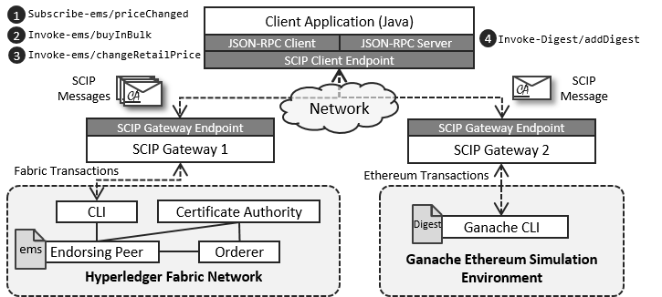
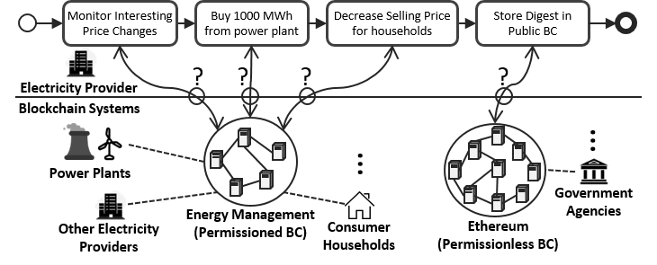

# Smart Contract Invocation Protocol (SCIP) Case Study

## Introduction

A case-study that shows how the [SCIP protocol](https://github.com/lampajr/scip) can be used in a heterogeneous multi-blockchain setup.

The following picture highlights the architecture of the distributed system that is invloved in the case study:


We will create the various components of this system, bring it up and then run a sample the client application against it.
The sample client application is described by the following figure:



## Prerequisits

- Active internet connection :)
- Docker with Docker-Compose
- Git bash (for Windows users)
- The ports 4200, 7050, 7051, 7054, 8080, 8081, 8082 8545 must be avaialable at the host machine.

## Setup

- The following instructions assume you are using Windows. Otherwise, ignore the requirement that you need to run the commands using git bash, since bash will be readily available for you.
- Using git bash, navigate to the `AutomateSetup` directory, and run the shell script `Start.sh`, i.e., 
  ```
  > cd AutomateSetup
  > ./Start.sh
  ```
   This will pull/create the necessary docker images, execute the docker-compose file to bring up the various docker containers needed, and deploy the Ethereum and Fabric smart contracts.
- When the script is fully executed, you can proceed to the [Demo](#demo) section below.
- At the end, you can bring down the network with the command 

  ```
  > ./Stop.sh
  ```

  You can also remove BAL and ganache-cli images by cmobining the previous command with the `rmi` option as follows:
  
  ```
  > ./Stop.sh rmi
  ``` 
 
## Demo

- __A Video of this demo is [availiable on Youtube](https://youtu.be/oiN_rKdk2EM)__
- Open the browser to http://localhost:4200 to open the frontend of the client applicaiton.
- Click on the button __Query State__. This should result in the state of the energy management system (EMS) shown on the left side of the page.
- Start the workflow demonstrated in the fiture above by clicking on the __Start Workflow__ button.
- Then a stream of log messages from the backend of the client application is shown on the right side with a black background.
- Wait until the _Subscribe_ request message is sent to the first Gateway and is confirmed by it.
- Send a POST message to the address: `http://localhost:8082/blockchain-access-layer/webapi?blockchain=fabric&blockchain-id=fabric-0&address=mychannel/ems`, which corresponds to the [SCL](https://github.com/ghareeb-falazi/scl) of the energy management system smart contract gateway of the Hyperledger Fabric permissioned blockchain, with the following body:

  ```
  {
      "jsonrpc": 2.0,
      "method": "Invoke",
      "id": 1,
      "params": {
          "functionIdentifier": "changeBulkPrice",
          "inputs": [{
            "name": "newPrice",
            "type": " {\"type\":\"integer\",\"minimum\": 0,\"maximum\":4294967295}",
            "value": 500
          } ],
          "outputs": [],
          "doc": 50,
          "callbackUrl": "http://localhost:8081/webapi/submit-transaction/dummy",
          "timeout": 100000,
          "correlationIdentifier": "abc",
          "signature": ""
      }
  }
  ```
  This has the effect of triggering the transaction that reduces the bulk energy price. You can use a tool like [Postman](https://www.getpostman.com/), or [curl](https://curl.haxx.se/) to achieve this task.
- Go back to the frontend, and check how the log messages proceed according to the presercibed [workflow](https://github.com/ghareeb-falazi/SCIP-CaseStudy/blob/master/ClientApplication/scip-client-application/backend/src/main/java/blockchains/iaas/uni/stuttgart/de/scipcasestudy/clientapplication/backend/restapi/WorkflowController.java).
- When the _Done!!!_ message is received, recheck the state of the EMS and notice how it is changed according to the workflow.

## Notes

- The crpyto artifacts for Fabric are already generated. If you need to generate them again use the script [generate.sh](./AutomateSetup/fabric/_defaults-generation/generate.sh). Then you need to update the keyfile name mentioned inside the [docker-compose file](./AutomateSetup/docker-compose.yml) (in the `ca` service specification).
